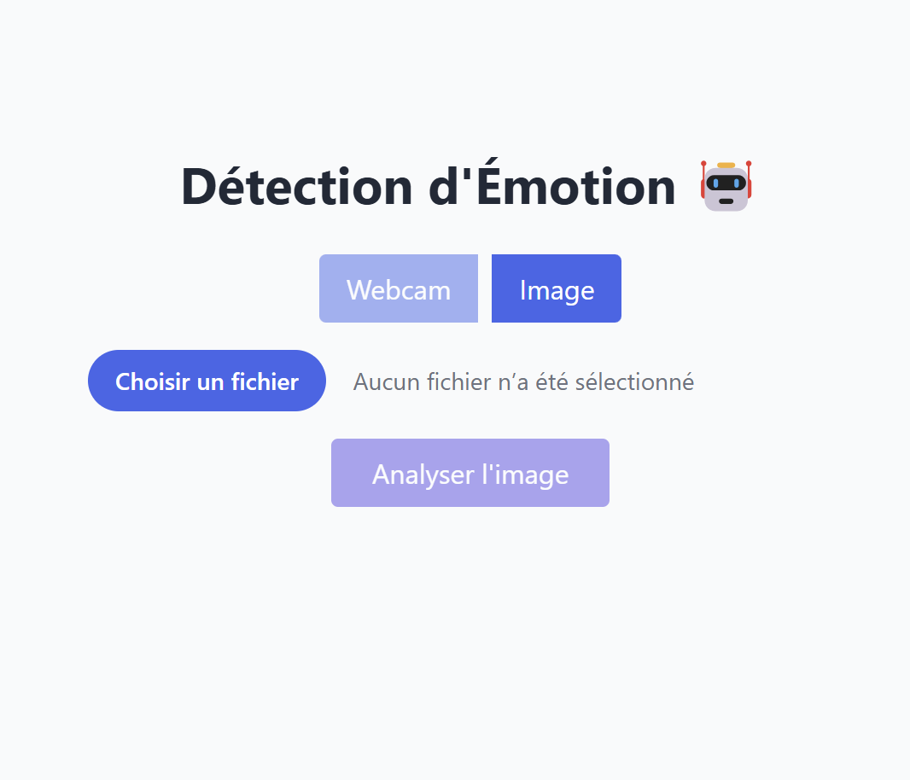

# 🧠 Real-Time Emotion Detection App

Bienvenue dans le projet **Real-Time Emotion Detection**, une application complète capable de détecter les émotions humaines à partir d'une **image** ou de la **caméra en temps réel**. Elle est construite avec **Python (OpenCV, dlib, Flask)** pour le backend, et **React + Tailwind CSS** pour le frontend.

---

## 🔗 Démo en ligne

🌐 Application Web : [https://emotion-app-j0yb0y28.vercel.app/](https://emotion-app-j0yb0y28.vercel.app/)

---

## 📁 Structure du projet

```
emotion-app/
├── backend/                   # Code Python (Flask API + détection)
│   ├── utils/                 # Prétraitement, extraction de landmarks, classifieurs
│   ├── data/                  # Données brutes (images), labels.csv
│   └── shape_predictor_68_face_landmarks.dat
├── frontend/                  # Application React
├── data/                      # Dataset CSV généré
├── run_data_preparer.py       # Génère le dataset CSV
├── run_all.py                 # Pipeline complet : build + évaluation + détection live
```

---

## 🧪 Fonctionnalités

- 🎥 Détection d’émotions via webcam ou image uploadée
- 😄 Émotions supportées : `happy`, `sadness`, `neutral`, `surprise`, `anger`, etc.
- 📈 Entraînement de plusieurs modèles (SVM, Random Forest, Gradient Boosting)
- 🧪 Évaluation avec GridSearchCV et StratifiedKFold
- 📦 Backend Flask avec API `/predict`
- ⚡ Frontend React avec TailwindCSS (mode clair/sombre)

---

## 🚀 Installation locale

### 1. Cloner le projet

```bash
git clone https://github.com/J0YB0Y28/emotion-app.git
cd emotion-app
```

### 2. Backend : installation Python

```bash
python -m venv venv
.env\Scriptsctivate
pip install -r requirements.txt
```

Puis pour lancer :

```bash
cd backend
python app.py
```

### 3. Frontend : installation React

```bash
cd frontend
npm install
npm run dev
```

---

## 🧠 Dataset & Détection

Tu peux entraîner ton propre dataset :

```bash
python data_preparer_simple.py
```

Puis lancer l’évaluation ou le live test :

```bash
python evaluator_v3.py
python backend/main.py
```

---

## 🛰️ Déploiement

- 🎯 Backend Flask : [Render.com](https://render.com)
- 🎯 Frontend React : [Vercel](https://vercel.com)

---

## 🙌 Auteur

Projet créé par **J0YB0Y28**  
Contact : kanaboumkwoiit@outlouk.com 

---

## ⭐ Crédit & Librairies

- `dlib` pour la détection de points de visage
- `OpenCV` pour le traitement d’image
- `scikit-learn` pour l'entraînement de modèles
- `Flask` & `Flask-CORS` pour l’API
- `React`, `Tailwind CSS`, `Vercel` pour le frontend

---

## 📸 Exemple visuel



---

## ✅ To-do futurs ?

- [ ] Amélioration du modèle avec deep learning
- [ ] Ajout d'une base de données pour sauvegarder les prédictions ? ¯\\_(ツ)_/¯
- [ ] Enregistrement des sessions utilisateur ? ¯\\_(ツ)_/¯
